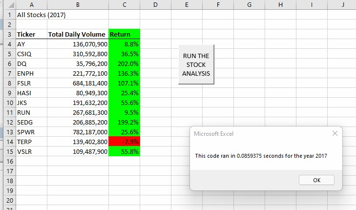
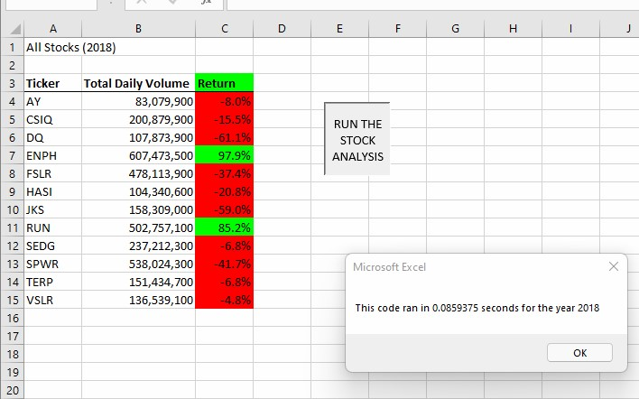

# Choosing the Right Investment
## A Stock Analysis for Data Analysis and Visualization
### Richard E Barber 2021

#### Overview

In this analysis we will examine two years' market performance for 12 stocks between 2017-18. The primary goal of this visualization is to determine which of the stocks perofrmed consistently well across two years' span.

#### Results

</img>

</img>

The ENPH stock had two years of positive returns in 2017-2018. 
* Previous years' returns are not necessarily an indicator of future performance, but may be an important factor in deciding on an investment portfolio.

#### Refactoring Summary

The refactored code ran at about the same speed as the old code.

In general refactoring can be done to 
1) clarify code readability and 
2) improve performace.

Althouh the performance did not seem to improve, the refactored code had more comments.
